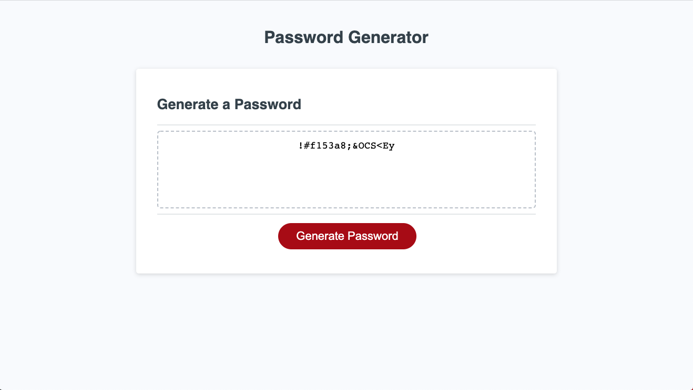

# Password_Generator

## What, Why, and How
With this assignment, I was motivated to put all my newfound JavaScript knowledge to the test by utilizing functions, for loops, while loops, and if statments. It was really intense and difficult, but I did it! To do this, I:
1. Prompted the user to decide which sets of characters they wanted to include as options in creating their password
2. Made sure they chose at least one character set
3. Stored their character sets into an array
4. Created a prompt that asked the user how many characters would they like their password to be (between 8 and 128)?
5. Made sure they chose a length that fell from 8 to 128 characters
6. Used the input from the prompt to create a password of the appropriate length
7. Used a for loop to choose the user-selected amount of random characters from the character set array
8. Returned the result onto the screen

Whew! That was a lot! 

The goal was to create a password generate that's responsive to user input and that doesn't have any console errors. After hours of work, I believe I succeeded. 

Through this process, I reinforced the fundamentals of JavaScript that I learned this week. It's one thing to know the theory behind things like functions, for loops, and if statements. To actually create a program using those statements and functions is much more difficult, but is also much more rewarding and far better at improving my programming skills. 

The area where I think my program stands out most is the edge cases. If the user tries to do anything outside of what's instructed, the program will not break, and the program will also tell the user what to do in order to generate a password. It took me a while to deal with those edge cases, but I'm really happy with the results. 

# Links
Link to Password Generator: https://andrew1835.github.io/Password_Generator/
Link to GitHub repository: https://github.com/andrew1835/Password_Generator

# Screenshots

This first screenshot shows what the page looks like upon load

 

This second screenshot shows a random password that was automatically generated by the application

